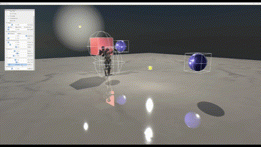
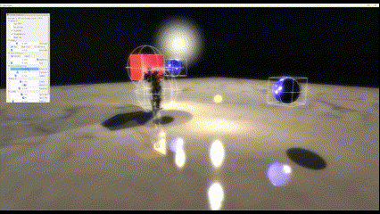
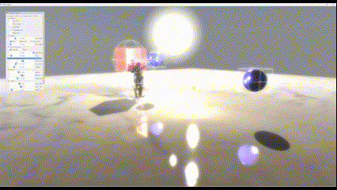
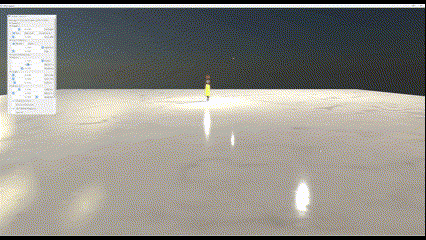

# OWL-Engine

## OverView

본 프로젝트는 3인칭 오픈월드 게임 필요한 기능들을 구현하는 것을 최종 목표로 하며, 그에 필요한 에디팅 기능을 추가할 것임.  
현재는 DirectX11를 이용한 간단한 렌더러이며, 모델 로더로의 기능을 제공하고 있음. 간단한 모델 조작과 후처리 기능을 제공함. 최종 목표로 가기 전 특정 컨셉 장면을 연출하는 것이 현 단계의 목표임.

※ 외부 라이브러리와 데이터 에셋은 별도로 필요.

## Features

- 간단한 PBR 적용.
- GBuffer를 이용한 Deferred shading 방식 적용.
- 간단한 IBL 적용.
- 간단한 캐릭터 애니메이션 적용.
- Shadow
  - 모든 그림자에 PCF 적용.
  - directinal light에서 cascade shadow map 사용.
  - point light, spot light를 위한 shadow map 사용.
- PostProcessing
  - Bloom.
  - Tone mapping.
  - depth map을 이용한 안개효과.
- IMGUI를 이용한 간단한 조작 툴 제공.

## Screenshots

## TODO

- Occclusion Culling을 위한 사전 & 본 작업.
- 각 부분 모듈화.
- GUI 에디터 지원.
- 컨셉 scene 설정.
- DirectX12 지원.
- DXR 지원.
